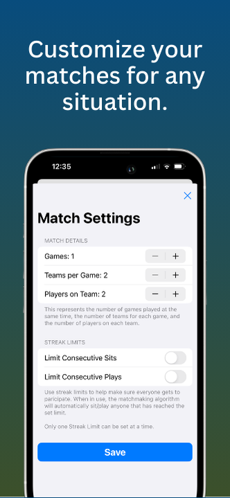
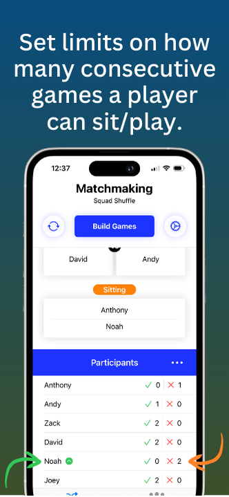
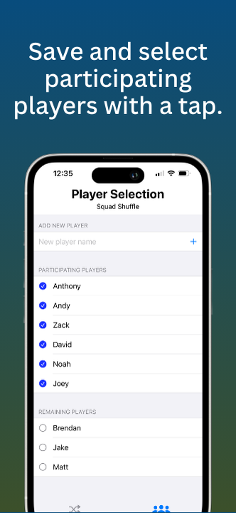

# Squad Shuffle

## App Overview

**Squad Shuffle** is a versatile app designed to simplify team matchmaking for group games. Whether you're playing pickleball, spikeball, or any other team-based game, this app provides an intuitive way to create balanced teams. Unlike other match randomizers that offer minimal functionality or clunky interfaces, Squad Shuffle enhances your gaming experience with a user-friendly design and advanced features tailored for group play.

## Demo
Check out the demo video for Squad Shuffle: [Video Demo](https://youtu.be/mk1K-3MAdJM)

## Screenshots

## Features

- **Local Player Management:** Save and manage your player list directly on your device.
- **Customizable Matchmaking:** Easily select participating players and customize game settings, such as the number of games, teams, and players per team.
- **Manual Designation:** Assign players to sit out or play, with the app automatically considering these designations for future matches.
- **Consecutive Game Limits:** Set limits on how many consecutive games a player can participate in or sit out.
- **Dynamic Rerolling:** If you’re not satisfied with the generated matchups, reroll without disrupting the consecutive game tracking.
- **Error Handling and Alerts:** Comprehensive error handling and user alerts guide you through any issues that arise.

## Technologies Used

- **Swift:** For robust and efficient app development.
- **SwiftUI:** To create a modern, responsive user interface.
- **CoreData:** For local data storage and management.

## Installation Instructions

To run Squad Shuffle locally:

1. Clone this repository to your local machine.
2. Open the project in Xcode.
3. Build and run the app using Xcode. 

Note: Since this is an iOS app and not listed on the App Store, you'll need to run it on a simulator or a connected device through Xcode.

## Usage Instructions

1. **Add Players:** Begin by adding players to the app.
2. **Select Participants:** Choose which players will be participating in the current game.
3. **Customize Game Settings:** Adjust settings based on your game requirements (e.g., number of games, teams, etc.).
4. **Build Games:** Press the "Build Games" button to generate random matchups.
5. **Manage Player Status:** Use swipe actions to manually designate players' statuses for future games.

## Future Plans

- **Premium Features:** Introduce skill-based matchmaking and tournament modes.
- **Group Tracking:** Save and manage groups of players, track their stats, and monitor wins and losses.

